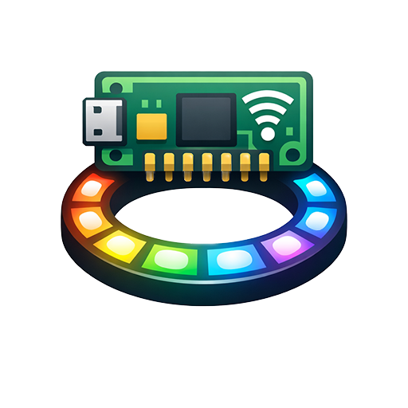

# 🌈 PicoW NeoPixel Home Assistant Integration


[](https://github.com/hacs/integration)
[](https://github.com/maxi07/PicoW-Neopixel-Homeassistant-Integration/actions/workflows/hassfest.yml)
[](https://github.com/maxi07/PicoW-Neopixel-Homeassistant-Integration/actions/workflows/hacs.yml)

A custom Home Assistant integration for controlling NeoPixel LED strips connected to Raspberry Pi Pico W devices via a REST API.

## Features

- **Automatic HTTP Network Discovery**: Devices are automatically discovered via network scanning
- **Full LED Control**: Control color (RGB), brightness, and power state
- **8 Built-in Effects**: Rainbow, fade, chase, breathing, twinkle, scanner, strobe, and static
- **Real-time Updates**: Integration polls device state and updates immediately after commands
- **Reliable Connection**: Automatic reconnection handling and error recovery
- **Device Information**: View device details including IP, MAC address, and LED count
- **Easy Setup**: Simple configuration flow with automatic device detection

## Requirements

- Home Assistant 2023.1 or newer
- PicoW NeoPixel device already configured and running on your network
- Device and Home Assistant must be on the same network

## 🛠️ Installation

### Part 1: PicoW Device Setup

Install the PicoW Neopixel code on to your Raspberry Pico, see [other repository](https://github.com/maxi07/PicoW-Neopixel-Homeassistant-Client).

### Part 2: Install this integration

#### HACS (Recommended)

1. Make sure [HACS](https://hacs.xyz/) is installed in your Home Assistant instance
2. Click the button below to add this repository:

   [](https://my.home-assistant.io/redirect/hacs_repository/?owner=maxi07&repository=PicoW-Neopixel-Homeassistant-Integration&category=integration)

3. Search for "PicoW NeoPixel" in HACS and install it
4. Restart Home Assistant

#### Manual Installation

1. Copy the `picow_neopixel` folder to your Home Assistant `custom_components` directory:
   ```bash
   mkdir -p /config/custom_components
   cp -r picow_neopixel /config/custom_components/
   ```

2. Restart Home Assistant:
   - Go to **Settings** → **System** → **Restart**

## ⚙️ Setup

### Automatic Setup (Recommended)

The integration will automatically scan your network for PicoW NeoPixel devices:

1. Go to **Settings** → **Devices & Services**
2. Click **+ Add Integration**
3. Search for "PicoW NeoPixel"
4. Wait while the integration scans your network (this may take up to 60 seconds)
5. Select your device from the list of discovered devices
6. Click **Submit**

The integration scans your local network(s) to find devices. If you're running Home Assistant in Docker, it will also scan common home network ranges.

### Manual Setup

If automatic discovery doesn't find your device:

1. Go to **Settings** → **Devices & Services**
2. Click **+ Add Integration**
3. Search for "PicoW NeoPixel"
4. If no devices are found, enter the device information manually:
   - **Host**: IP address of your PicoW device
   - **Port**: Default is 80
5. Click **Submit**

The integration will verify the connection and add the device.

## Usage

### Basic Control

Once configured, the device appears as a light entity in Home Assistant. You can control:

- **Power**: Turn on/off
- **Brightness**: Adjust from 0-255
- **Color**: Pick any RGB color

### Effects

The integration supports 8 built-in effects:

- **Static**: Solid color (default)
- **Rainbow**: Animated rainbow cycle
- **Fade**: Smooth color transitions
- **Chase**: Running light effect
- **Breathing**: Pulsing brightness
- **Twinkle**: Random sparkle effect
- **Scanner**: Knight Rider style
- **Strobe**: Strobe light effect

###  Automations
Automations can be configured and the device exposes actions such as setting the brightness, color, or starting an effect.

## 🔧 Troubleshooting

### 🔍 Device Not Discovered

1. ✅ Ensure the PicoW device is powered on and connected to WiFi
2. 🌐 Check that Home Assistant and the Pico W are on the same network
3. 📝 Try manual setup using the device's IP address
4. 📋 Check the Pico W logs for errors

### 🔌 Connection Issues

1. 📍 Verify the IP address hasn't changed (consider setting a static IP)
2. 🔥 Check firewall settings
3. 🏓 Test connectivity: `ping <device_ip>`
4. 🌐 Try accessing `http://<device_ip>/info` in a browser

### 💫 Effects Not Working

1. ⚡ The device must be turned on for effects to work
2. 🎨 Effects override color settings
3. 📋 Check Home Assistant logs for error messages
4. 🔋 Verify the Pico W has sufficient power for all LEDs

### ❌ Integration Shows Unavailable

1. 🌐 Check network connectivity
2. 🔄 Restart the Pico W device
3. 📋 Check logs: **Settings** → **System** → **Logs**
4. 🗑️ Try removing and re-adding the integration

## 📊 Device Information

The integration exposes the following information as entity attributes:

- `device_id`: Unique device identifier
- `ip_address`: Current IP address
- `mac_address`: MAC address
- `num_leds`: Number of LEDs configured

Access these in Developer Tools → States or use in templates:

```yaml
{{ state_attr('light.picow_neopixel', 'ip_address') }}
```

## 🔗 API Endpoints

- `GET /info` - Device information and capabilities
- `GET /state` - Current LED state
- `POST /control` - Send commands

## ⚙️ Configuration

No adonal configuration is needed after setup. All settings are configured on the PicoW device itself via its `config.json` file.

### 🔢 Multiple Devices

To use multiple PicoW NeoPixel devices:

1. Give each device a unique `device.id` in `config.json`
2. Use different `device.name` for easy identification
3. Add each device separately in Home Assistant

### 📌 Static IP Address

Recommended for reliability:

1. In your router, reserve an IP for the Pico W's MAC address
2. This prevents connection issues after device restarts

## 🗑️ Uninstalling

1. Go to **Settings** → **Devices & Services**
2. Find the PicoW NeoPixel integration
3. Click the three dots menu → **Delete**
4. Ree the `custom_components/picow_neopixel` folder
5. Restart Home Assistant

## 🔒 Security & Privacy

**Privacy:**
- ✅ Only communicates locally on your network
- ✅ No data sent to external services
- ✅ No analytics or telemetry

**Security Note:**
The integration uses HTTP (not HTTPS) for simplicity. Since it operates on your local network, this is generally acceptable. For enhanced security:
- 🔐 Keep devices on isolated VLAN
- 🚫 Don't expose to internet
- 🔑 Use strong WiFi passwords

## 🛠️ Technical Details

- **Platform**: Light
- **Communication**: HTTP REST API
- **Device Not Discovered

1. Ensure the PicoW device is powered on and connected to WiFi
2. Verify that Home Assistant and the Pico W are on the same network/subnet
3. If running Home Assistant in Docker, the integration automatically scans common home networks
4. Wait the full 60 seconds for the network scan to complete
5. Try manual setup using the device's IP address
6. Check that port 80 is accessible on the device

### Connection Issues

1. Verify the device is reachable: `ping <device_ip>`
2. Test the API endpoint in a browser: `http://<device_ip>/info`
3. Check firewall settings on both Home Assistant and the device
4. Consider setting a static IP for the device in your router
5. Check Home Assistant logs: **Settings** → **System** → **Logs**

### Integration Shows Unavailable

1. Check network connectivity between Home Assistant and the device
2. Verify the device IP address hasn't changed
3. Restart the PicoW device
4. Check integration logs for specific error messages
5. Try removing and re-adding the integration

### Effects Not Working

1. Ensure the light entity is turned on
2. Device Information

The integration exposes the following information as entity attributes:

- `device_id`: Unique device identifier
- `ip_address`: Current IP address
- `mac_address`: MAC address
- `num_leds`: Number of LEDs configured

Access these in Developer Tools → States or use in templates:

```yaml
{{ state_attr('light.picow_neopixel', 'ip_address') }}
```

## Configuration

### Multiple Devices

The integration supports multiple PicoW NeoPixel devices. Simply add each device separately through **Settings** → **Devices & Services**. Each device must have a unique device ID configured on the PicoW itself.

### Static IP Recommendation

For improved reliability, configure a static IP address or DHCP reservation for your PicoW device in your router. This prevents connection issues if the device IP changes.

## 🗑️ Uninstalling

1. Go to **Settings** → **Devices & Services**
2. Find the PicoW NeoPixel integration
3. Click the three dots menu → **Delete**
4. Confirm deletion

To completely remove the integration:
1. Delete all device entries as described above
2. Remove the `custom_components/picow_neopixel` folder
3. Restart Home Assistant

## Technical Details

- **Platform**: Light
- **Communication**: HTTP REST API
- **Discovery Method**: HTTP network scanning
- **Scan Timeout**: 60 seconds (30 parallel scans)
- **Update Interval**: 10 seconds
- **Command Timeout**: 10 seconds
- **Supported Networks**: Automatically detects local networks, includes common home networks for Docker installationAPI Endpoints

The integration communicates with the PicoW device using these REST API endpoints:

- `GET /info` - Device information and capabilities
- `GET /state` - Current LED state
- `POST /control` - Send commands (power, color, brightness, effects)

## Security & Privacy

- Only communicates locally on your network
- No data sent to external services
- No analytics or telemetry
- Uses HTTP (not HTTPS) for local network communication

For enhanced security:
- Keep devices on an isolated VLAN
- Do not expose the integration to the internet
- Use strong WiFi passwords for your devices

## Credits

**Author**: Maximilian Krause  
**Version**: 1.0.0  
**License**: MIT

## 📝 Changelog

### Version 1.0.0 (Initial Release)
- Full RGB color control
- Brightness control (0-255)
- 8 built-in effects
- Automatic HTTP network device discovery
- Manual configuration support
- Real-time state updates
- Automatic reconnection handling
- Comprehensive error handling and logging
- Docker network support